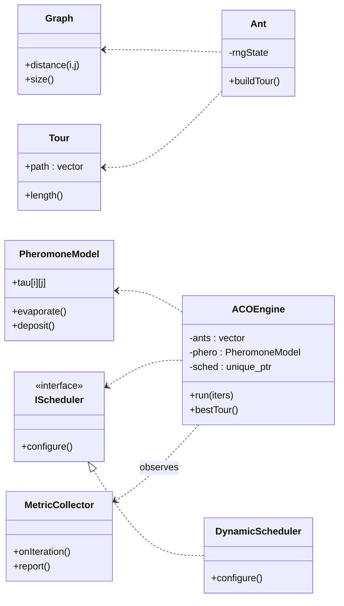
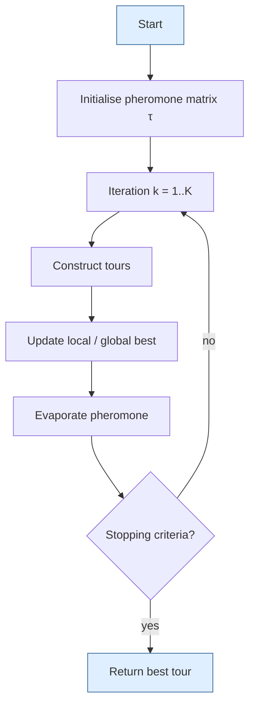
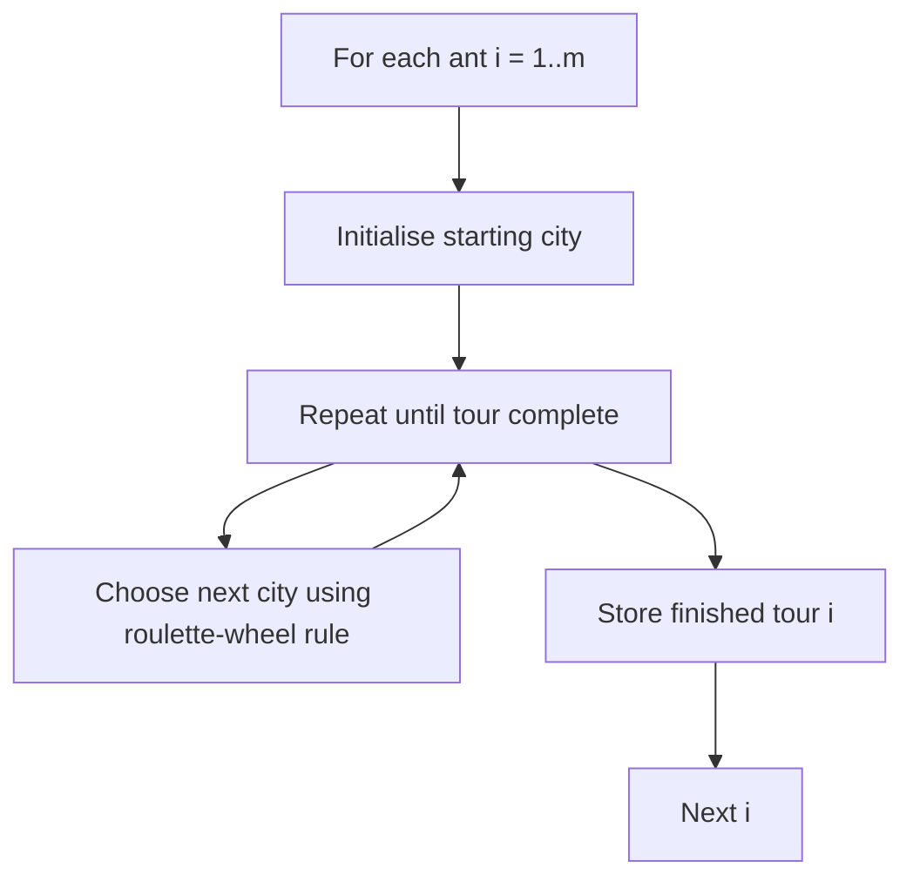

# Parallel ACO for TSP – Project Start
<!-- # push test -->

**🎯 Current Status**: BDD Scenarios 1-3 完成 | 核心 ACO 機率選擇實作完成 | 22/22 測試通過

## 1. Project Goal

Implement a **shared‑memory parallel Ant Colony Optimization (ACO)** solver for the Traveling‑Salesman Problem on an Intel multi‑core CPU using **OpenMP 5.1**, developed with clean OOA/OOD/OOP principles and driven by **TDD + BDD**.  The repository will be public to the teaching staff from day 0 so that progress is fully transparent.

## 📊 Development Progress

| BDD Scenario | Status | Features | Tests |
|--------------|--------|----------|-------|
| ✅ **01_walking_skeleton** | 完成 | 建置環境驗證 | 5 |
| ✅ **02_construct_tour** | 完成 | Hamiltonian 迴路構建 | 15 |
| ✅ **03_probabilistic_choice** | 完成 | ACO 機率選擇 (τ^α·η^β) | 22 |
| 🔄 **04_evaporation** | 開發中 | 費洛蒙蒸發機制 | - |
| ⏳ **05_delta_accumulation** | 待開發 | 費洛蒙累積 | - |
| ⏳ **06_delta_merge** | 待開發 | 平行費洛蒙合併 | - |
| ⏳ **07_parallel_consistency** | 待開發 | OpenMP 平行化 | - |

## 🚀 Quick Start

```powershell
# 建置專案
cd "d:\D_backup\2025\tum\Parallel ACO for TSP"
mkdir build -ErrorAction SilentlyContinue
cd build
cmake ..
cmake --build .

# 運行測試
.\unit_tests.exe

# 執行主程式
.\aco_main.exe
```

## 🏗️ Implemented Core Features

### ✅ **Graph Representation**
- 對稱距離矩陣 (N×N)
- 隨機距離初始化
- 自訂距離設置 (測試用)

### ✅ **ACO Probabilistic Selection**
- 標準 ACO 機率公式: `P(i→j) = [τ(i,j)^α · η(i,j)^β] / Σ[τ(i,k)^α · η(i,k)^β]`
- 輪盤選擇演算法 (Roulette Wheel Selection)  
- 參數化 α (費洛蒙重要性) 和 β (距離重要性)
- 啟發式資訊計算 (η = 1/distance)

### ✅ **Pheromone Management**
- 費洛蒙矩陣初始化與管理
- 費洛蒙讀取/設置操作
- 最小費洛蒙值限制

### ✅ **Tour Construction**
- Hamiltonian 迴路構建
- 自動路徑長度計算
- 訪問狀態管理

## 📈 Test Coverage: 22/22 (100%)

```
[==========] Running 22 tests from 6 test suites.
[  PASSED  ] 22 tests.
```

**詳細開發報告**: 請參閱 [`DEVELOPMENT_REPORT.md`](./DEVELOPMENT_REPORT.md)allel ACO for TSP – Project Start
<!-- # push test -->
## 1. Project Goal

Implement a **shared‑memory parallel Ant Colony Optimization (ACO)** solver for the Traveling‑Salesman Problem on an Intel multi‑core CPU using **OpenMP 5.1**, developed with clean OOA/OOD/OOP principles and driven by **TDD + BDD**.  The repository will be public to the teaching staff from day 0 so that progress is fully transparent.

---

## 2. High‑Level Architecture



---

## 2.2 Algorithm Flow (Common ACO Loop)



### 2.3 Strategy Micro‑flow: Serial vs. Parallel

The overall loop is identical; only **Step S3 – “Construct tours”** is replaced by different micro‑flows.

#### (a) Serial Construction Strategy



#### (b) Parallel Construction Strategy (OpenMP)

```mermaid
flowchart TD
    P0[omp parallel for (dynamic)] --> P1[Thread t builds tour for ant i]
    P1 --> P2[Thread‑local Δτ update]
    P2 --> P3{All threads done?}
    P3 -- no --> P1
    P3 -- yes --> P4[omp critical: merge Δτ]
    P4 --> P5[Reduction(min): update global best]
```

*Note:*  The parallel version keeps the same pheromone decision rule but isolates updates via **thread‑local buffers** and uses `reduction(min:bestCost)` for the global best path.

---

## 3. Development Flow


---

## 4. Repository Layout (initial)

```
.
├── CMakeLists.txt
├── README.md
├── run_tests.sh
├── include/
│   ├── graph.hpp
│   ├── tour.hpp
│   ├── ant.hpp
│   ├── pheromone.hpp
│   ├── scheduler.hpp
│   ├── engine.hpp
│   └── metrics.hpp
├── src/
│   ├── main.cpp
│   └── ...
├── tests/
│   ├── test_graph.cpp
│   ├── test_ant.cpp
│   └── ...
├── data/
│   ├── eil101.tsp
│   ├── pcb442.tsp
│   └── pr1002.tsp
└── scripts/
    ├── benchmark_serial.sh
    └── roofline.py
```

---

## 5. Milestones & Timeline

| Week | Tag    | Deliverable                                      |
| ---- | ------ | ------------------------------------------------ |
| 1    | `v0.1` | Graph & Tour classes + unit tests + repo layout  |
| 2    | `v0.2` | Serial ACO complete; baseline CSV; CI green      |
| 3    | `v0.3` | OpenMP ACO ≥ 6× speed‑up; TDD coverage ≥ 80 %    |
| 4    | `v0.4` | Profiling & Roofline; optimised version          |
| 5    | `v1.0` | Final report, slides, and reproducibility script |

---

## 6. Coding & Process Principles

* **SOLID / DRY / KISS** adhered to in all classes.
* **TDD** with Catch2; tests live under `/tests` and run in CI.
* **BDD** Gherkin `.feature` files in `/features`; optional automation later.
* **CI** via GitLab CI: build, format check, unit tests, coverage.
* **Coverage** tracked with `gcov + lcov`, badge in README.

---

*Last updated: {{DATE}}*

## 3. Test Strategy – Granular "Pyramid"

> **Why**: Ensure each interchangeable component behaves correctly in isolation **before** validating combined behaviour in Serial/Parallel engines.

### 3.1 Test Layers

| Layer                        | Scope                          | Target Classes / Templates                  | Example Assertions                                 |
| ---------------------------- | ------------------------------ | ------------------------------------------- | -------------------------------------------------- |
| **Unit**                     | Pure functions / small classes | `Graph`, `DistanceMatrix`, `MatrixMul`      | `EXPECT_DOUBLE_EQ(distance(3,7), distance(7,3))`   |
| **Component**                | Multiple objects interact      | `Ant`, `PheromoneModel`, `SchedulerDynamic` | Ant visits n cities once, Δτ accumulates correctly |
| **Integration**              | Full engine (Seq / Par)        | `SerialACOEngine`, `ParallelACOEngine`      | Tour quality within 1 %, speed‑up ≥ 6×             |
| **System / Behaviour (BDD)** | CLI + config                   | `aco --omp 8 pr1002.tsp`                    | Exit 0, CSV output, runtime threshold              |

### 3.2 BDD Framework Choice

* **Framework** : **cucumber‑cpp** (2025‑04) + **Google Test** backend.
* **Scenario naming rule** : `<Layer>_<Given>_<Then>` ‑ e.g. `Integration_SerialSolveEil51_QualityWithin1pct`.
* **Runtime dependency** : Ruby ≥ 3.0 (for Cucumber CLI). GitLab CI image will install Ruby via `apt`.

### 3.3 Minimal Working Example

```bash
# features/serial_eil51.feature
Feature: Serial engine basic correctness
  Scenario: Integration_SerialSolveEil51_QualityWithin1pct
    Given a TSP file "eil51.tsp"
    When I solve it with "aco --seq"
    Then the tour length should be within 1% of 426
```

```cpp // features/steps/serial_steps.cpp
#include <gtest/gtest.h>
#include "bdd_macros.hpp"

GIVEN("a TSP file \"eil51.tsp\"") {
    graph = Graph::fromFile("eil51.tsp");
}
WHEN("I solve it with \"aco --seq\"") {
    SerialACOEngine eng(graph);
    eng.run(200);
    cost = eng.bestTour().length();
}
THEN("the tour length should be within 1% of 426") {
    EXPECT_NEAR(cost, 426.0, 4.26);
}
```

### 3.4 CMake & CI Snippets

```cmake
# CMakeLists.txt (excerpt)
find_package(GTest REQUIRED)
add_subdirectory(external/cucumber-cpp)
add_executable(bdd_runner
    features/steps/serial_steps.cpp
    ...)
target_link_libraries(bdd_runner
    cucumber-cpp::cucumber gtest gtest_main pthread)
add_test(NAME bdd COMMAND cucumber features)
```

```yaml
# .gitlab-ci.yml (excerpt)
stages: [build, test]

image: ubuntu:24.04

before_script:
  - apt-get update && apt-get install -y build-essential cmake ruby ruby-dev git
  - gem install cucumber --no-document

build:
  stage: build
  script:
    - cmake -B build -DCMAKE_CXX_STANDARD=20
    - cmake --build build -j$(nproc)

test:bdd:
  stage: test
  script:
    - cd build && ctest -L bdd --output-on-failure
```

### 3.5 Test‑Execution Order

1. **Unit tests** (Google Test) ‑ always run.
2. **Component tests** (Google Test fixtures) ‑ always run.
3. **Integration & BDD scenarios** (cucumber/cpp) ‑ run on push; mark heavy cases with `@slow` and schedule nightly.

### 3.6 Coverage

* Compile with `-fprofile-arcs -ftest-coverage`; use `gcov` + `lcov` to generate HTML.
* Upload coverage artefact in GitLab Pages for reviewer access.
