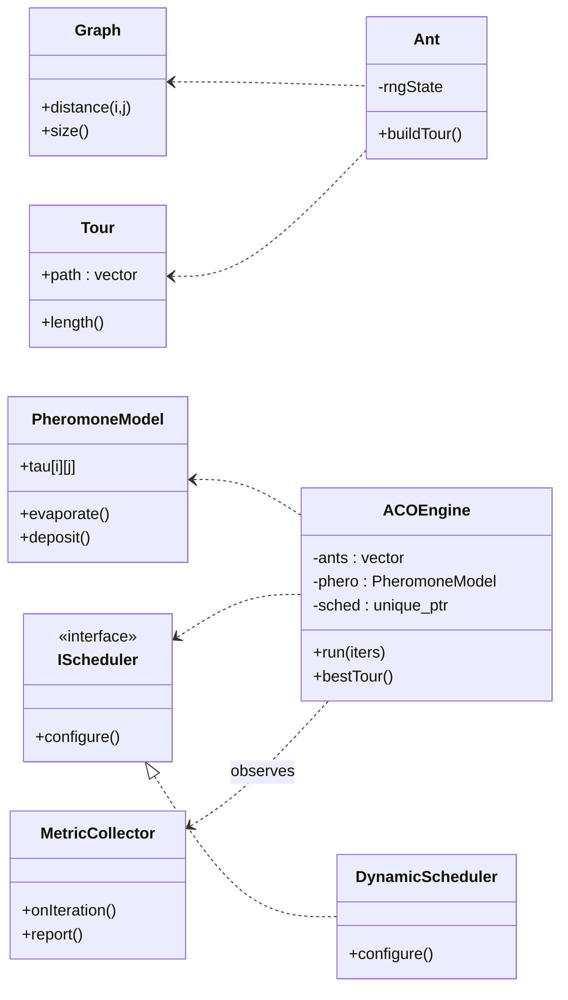
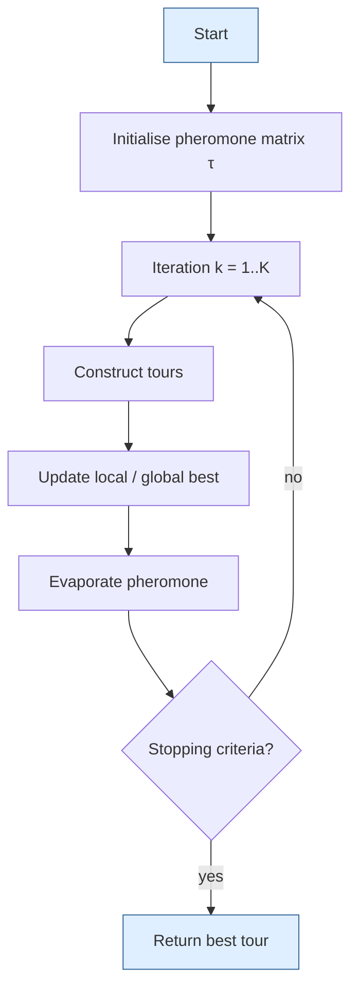
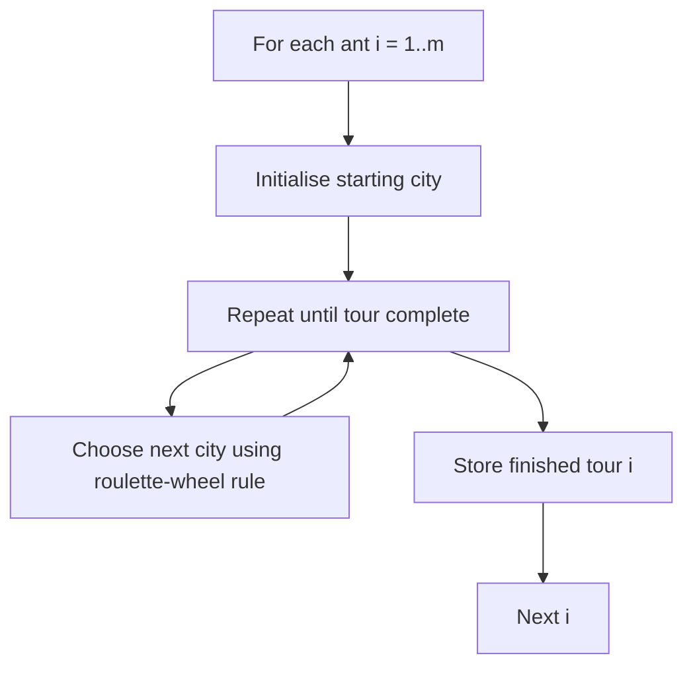
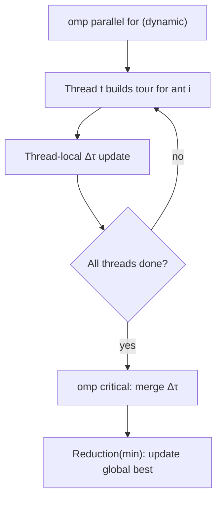
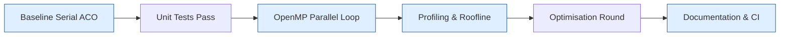

# Parallel ACO for TSP – Project Start

## 1. Project Goal

Implement a **shared‑memory parallel Ant Colony Optimization (ACO)** solver for the Traveling‑Salesman Problem on an Intel multi‑core CPU using **OpenMP 5.1**, developed with clean OOA/OOD/OOP principles and driven by **TDD + BDD**.  The repository will be public to the teaching staff from day 0 so that progress is fully transparent.

---

## 2. High‑Level Architecture



---

## 2.2 Algorithm Flow (Common ACO Loop)



### 2.3 Strategy Micro‑flow: Serial vs. Parallel

The overall loop is identical; only **Step S3 – “Construct tours”** is replaced by different micro‑flows.

#### (a) Serial Construction Strategy



#### (b) Parallel Construction Strategy (OpenMP)



*Note:*  The parallel version keeps the same pheromone decision rule but isolates updates via **thread‑local buffers** and uses `reduction(min:bestCost)` for the global best path.

---

## 3. Development Flow



---

## 4. Repository Layout (initial)

```
.
├── CMakeLists.txt
├── README.md
├── run_tests.sh
├── include/
│   ├── graph.hpp
│   ├── tour.hpp
│   ├── ant.hpp
│   ├── pheromone.hpp
│   ├── scheduler.hpp
│   ├── engine.hpp
│   └── metrics.hpp
├── src/
│   ├── main.cpp
│   └── ...
├── tests/
│   ├── test_graph.cpp
│   ├── test_ant.cpp
│   └── ...
├── data/
│   ├── eil101.tsp
│   ├── pcb442.tsp
│   └── pr1002.tsp
└── scripts/
    ├── benchmark_serial.sh
    └── roofline.py
```

---

## 5. Milestones & Timeline

| Week | Tag    | Deliverable                                      |
| ---- | ------ | ------------------------------------------------ |
| 1    | `v0.1` | Graph & Tour classes + unit tests + repo layout  |
| 2    | `v0.2` | Serial ACO complete; baseline CSV; CI green      |
| 3    | `v0.3` | OpenMP ACO ≥ 6× speed‑up; TDD coverage ≥ 80 %    |
| 4    | `v0.4` | Profiling & Roofline; optimised version          |
| 5    | `v1.0` | Final report, slides, and reproducibility script |

---

## 6. Coding & Process Principles

* **SOLID / DRY / KISS** adhered to in all classes.
* **TDD** with Catch2; tests live under `/tests` and run in CI.
* **BDD** Gherkin `.feature` files in `/features`; optional automation later.
* **CI** via GitLab CI: build, format check, unit tests, coverage.
* **Coverage** tracked with `gcov + lcov`, badge in README.

---

*Last updated: {{25/07/20}}*
