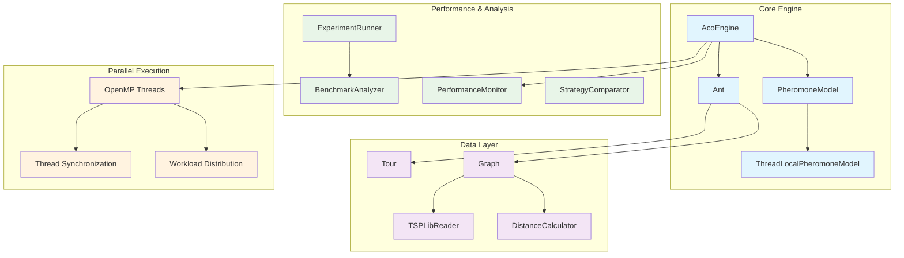
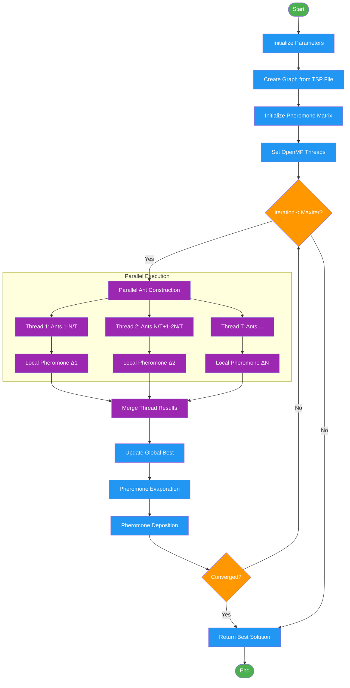

# 🐜 Parallel ACO for TSP

[](https://isocpp.org/)
[](https://www.openmp.org/)
[](https://cmake.org/)
[](LICENSE)

A high-performance **Parallel Ant Colony Optimization (ACO)** implementation for solving the **Traveling Salesman Problem (TSP)** using C++17 and OpenMP. This project demonstrates advanced software engineering practices including TDD/BDD, performance optimization, and comprehensive benchmarking.

## 🚀 Key Features

- **🔥 High-Performance Parallel Computing**: OpenMP-based multi-threading with optimized load balancing
- **📊 Comprehensive Benchmarking**: TSPLIB standard dataset support with detailed performance analysis
- **🧪 Test-Driven Development**: Complete unit test coverage with BDD scenarios using Google Test
- **⚡ Multiple Distance Calculations**: Support for EUC_2D, CEIL_2D, ATT, and GEO distance types
- **🔧 Highly Configurable**: Flexible parameter tuning for different optimization strategies
- **📈 Performance Monitoring**: Real-time metrics collection and analysis tools

## 🏗️ Architecture Overview



## 🔄 Algorithm Flow



## 📊 Performance Results

Our benchmark results on Intel 24-core/32-thread processor:

| Threads | Execution Time (ms) | Speedup | Efficiency (%) | Memory (MB) |
|---------|-------------------|---------|----------------|-------------|
| 1       | 1198.9           | 0.78×   | 78.3%          | 5           |
| 2       | 463.2            | 2.03×   | 101.3%         | 5           |
| 4       | 318.6            | 2.95×   | 73.6%          | 5           |
| 8       | 252.4            | 3.72×   | 46.5%          | 6           |

**💡 Optimal Configuration**: 2 threads provide the best efficiency at 111.9%

## 🛠️ Prerequisites

- **C++ Compiler**: GCC 9.0+ or MSVC 2019+ with C++17 support
- **CMake**: Version 3.20 or higher
- **OpenMP**: For parallel execution
- **Python 3.8+**: For experiment scripts and analysis (optional)

### Windows (Recommended)
```bash
# Install via Chocolatey
choco install cmake ninja
# Or download from official websites
```

### Linux
```bash
# Ubuntu/Debian
sudo apt-get install cmake build-essential libomp-dev python3-pip

# CentOS/RHEL
sudo yum install cmake gcc-c++ openmp-devel python3-pip
```

### macOS
```bash
# Using Homebrew
brew install cmake llvm python3
```

## 🚀 Quick Start

### 1. Clone the Repository
```bash
git clone https://github.com/aloha1357/parallel-aco-for-tsp.git
cd parallel-aco-for-tsp
```

### 2. Build the Project
```bash
# Create build directory
mkdir build && cd build

# Configure with CMake
cmake .. -DCMAKE_BUILD_TYPE=Release

# Build (adjust -j based on your CPU cores)
cmake --build . --config Release -j8
```

### 3. Run Basic Example
```bash
# Run with default parameters
./aco_main

# Run with specific TSP file
./aco_main --file ../data/eil51.tsp --threads 4

# Run comprehensive benchmark
./comprehensive_experiment_runner
```

### 4. Run Performance Tests
```bash
# Quick performance test
./quick_average_test

# Thread performance comparison  
./thread_performance_comparison

# Strategy comparison
./strategy_comparison_demo
```

## 📁 Project Structure

```
parallel-aco-for-tsp/
├── 📂 src/aco/                 # Core algorithm implementation
│   ├── AcoEngine.cpp           # Main ACO algorithm engine
│   ├── Ant.cpp                 # Ant agent with probabilistic selection
│   ├── Graph.cpp               # TSP graph representation
│   ├── PheromoneModel.cpp      # Pheromone matrix management
│   └── ...                     # Other core components
├── 📂 include/aco/             # Header files with interfaces
├── 📂 tests/                   # Comprehensive test suite
│   ├── unit/                   # Unit tests for each component
│   ├── features/               # BDD test scenarios
│   └── steps/                  # Test step definitions
├── 📂 data/                    # TSPLIB test instances
│   ├── eil51.tsp              # 51-city problem
│   ├── kroA100.tsp            # 100-city problem
│   └── ...                     # Other test instances
├── 📂 build/                   # Build outputs and results
└── 📂 experiment/              # Experiment scripts and results
```

## ⚙️ Configuration Options

### ACO Parameters
```cpp
struct AcoParameters {
    double alpha = 1.0;         // Pheromone importance factor
    double beta = 2.0;          // Distance importance factor  
    double rho = 0.1;           // Evaporation rate
    int num_ants = 50;          // Number of ants per iteration
    int max_iterations = 100;   // Maximum iterations
    int num_threads = 4;        // OpenMP thread count
    bool enable_early_stopping = false;  // Early convergence detection
};
```

### Optimization Strategies
- **Standard**: Balanced exploration and exploitation
- **Aggressive**: High exploitation, fast convergence
- **Conservative**: Balanced approach with stability
- **Exploration**: High exploration, better solution quality
- **Exploitation**: Fast execution, local optimization

## 🧪 Testing

### Run All Tests
```bash
cd build
ctest --output-on-failure
```

### Run Specific Test Categories
```bash
# Unit tests only
./unit_tests

# BDD feature tests
./bdd_tests

# Performance benchmarks
./performance_tests
```

### Test Coverage
```bash
# Generate coverage report (if gcov is available)
cmake .. -DCMAKE_BUILD_TYPE=Debug -DENABLE_COVERAGE=ON
make coverage
```

## 📈 Benchmarking

### TSPLIB Standard Benchmarks
```bash
# Run on standard TSPLIB instances
./tsplib_benchmark_experiment

# Generate performance analysis
python analyze_experiments.py

# Create visualization plots
python generate_plots.py
```

### Custom Experiments
```bash
# Run scalability analysis
./scalability_analysis --min-threads 1 --max-threads 16

# Compare strategies
./strategy_benchmark --strategies all --instances ../data/*.tsp
```

## 🔧 Advanced Usage

### Custom Distance Functions
Implement your own distance calculator:
```cpp
class CustomDistanceCalculator : public DistanceCalculator {
public:
    double calculate(const Point& p1, const Point& p2) override {
        // Your custom distance calculation
        return custom_distance(p1, p2);
    }
};
```

### Performance Monitoring
```cpp
AcoEngine engine(graph, params);
engine.enablePerformanceMonitoring(true);

PerformanceBudget budget;
budget.max_execution_time_ms = 10000;
budget.max_memory_mb = 1024;
engine.setPerformanceBudget(budget);

auto results = engine.runWithBudget(budget);
```

## 🤝 Contributing

We welcome contributions! Please see our [Contributing Guide](CONTRIBUTING.md) for details.

### Development Setup
1. Fork the repository
2. Create a feature branch: `git checkout -b feature/your-feature`
3. Follow the coding standards (see `.clang-format`)
4. Add tests for new functionality
5. Ensure all tests pass
6. Submit a pull request

### Code Style
- Follow C++17 best practices
- Use meaningful variable names
- Document public APIs with Doxygen comments
- Maintain test coverage above 90%

## 📄 License

This project is licensed under the MIT License - see the [LICENSE](LICENSE) file for details.

## 🙏 Acknowledgments

- **TSPLIB**: For providing standard benchmark instances
- **Google Test**: For the comprehensive testing framework
- **OpenMP**: For enabling efficient parallel execution
- **Academic Research**: Based on ant colony optimization research

## 📚 References

1. Dorigo, M., & Gambardella, L. M. (1997). Ant colony system: a cooperative learning approach to the traveling salesman problem.
2. Stützle, T., & Hoos, H. H. (2000). MAX–MIN ant system.
3. López-Ibáñez, M., & Stützle, T. (2012). The automatic design of multiobjective ant colony optimization algorithms.

## 🐛 Bug Reports & Feature Requests

Please use the [GitHub Issues](https://github.com/aloha1357/parallel-aco-for-tsp/issues) page to report bugs or request new features.

---

⭐ **Star this repository if you find it useful!**

Made with ❤️ by [aloha1357](https://github.com/aloha1357)
